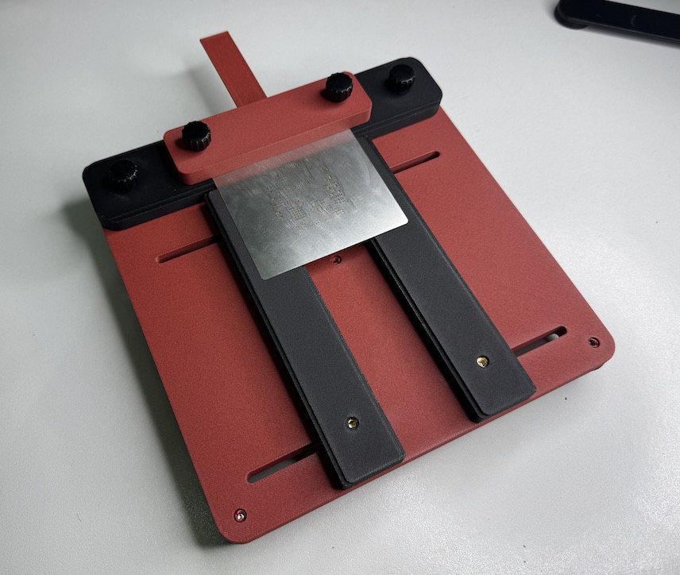

# StencilJig3D

</a>

A simple yet precise stencil printing jig for small, non-framework stencils. Currently supporting PCBs with a thickness of 1.6mm and 1.0mm. The three PCB guide bars (bar1, bar2 and bar_top) can be rotated 180deg to switch between these thicknesses.

For a complete stencil jig you have to print everything once (bar1 and bar2 are actually the same object). I've chosen PLA-CF in black and red from Bambulab.

Assembly: [watch video](https://www.instagram.com/maker.moekoe/reel/DBY5iGSNjgy/)

Solder paste result: [watch video](https://www.instagram.com/maker.moekoe/reel/DBiVZ_9N4vV/)

### What you need except the prints

- **14x** M4 threaded inserts (max 8mm height)
- **(4-6)x** 20mm machine rubber feet
- **8x** M4x15mm knurled screw

### Back view

</a>
